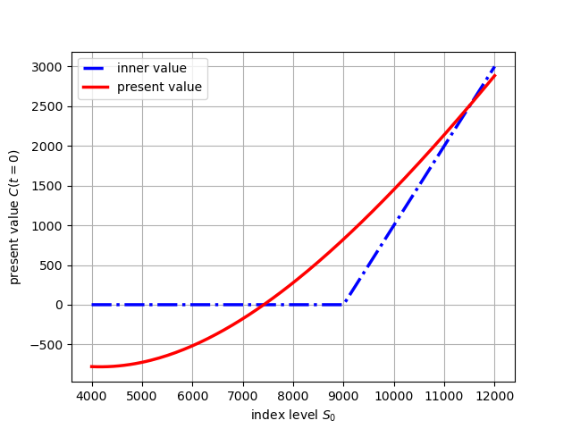

There are 3 scenarios for an option 
- $\textbf{ITM(In-the-Money)}$ - A call is ITM if $S > K$. A put is ITM $S < K$
- $\textbf{ATM(at-the-money)}$ - A call or a put $S = K$
- $\textbf{OTM(out-of-the-Money)}$ - A call is ITM if $S < K$. A put is ITM $S > K$
According to Black-Scholes-Merton, a closed form of pricing an European call option is given by:
$$C_0 = C^{BSM}(S_0, K, T, r, \sigma)$$
This can be implemented using the following mathematical equation:
$$C_0 = S_0 \cdot N(d_1) - Ke^{-rT}N(d_2)$$
Where:
$$d_1 = \frac{In(\frac{S_0}{K}) + (r + \frac{\sigma^2}{2})T}{\sigma \sqrt{T}} , d_2 = d_1 - \sigma \sqrt{T}$$
For stocks earning dividends yield (y = dividends / current value of the asset)
$$C_0 = S_0 \cdot e^{-yt} N(d_1) - Ke^{-rT}N(d_2)$$$$d_1 = \frac{In(\frac{S_0}{K}) + (r - y + \frac{\sigma^2}{2})T}{\sigma \sqrt{T}} , d_2 = d_1 - \sigma \sqrt{T}$$
In python, the above can be accomplished as:
```py
import math
from scipy.stats import norm

def BSM_call_value(S0, K=9000, T=1.0, r=0.025, sigma=0.2):
    # Compute d1 and d2
    d1 = (math.log(S0 / K) + (r + 0.5 * sigma**2) * T) / (sigma * math.sqrt(T))
    d2 = d1 - sigma * math.sqrt(T)
    
    # Black-Scholes formula
    call_price = S0 * norm.cdf(d1) - K * math.exp(-r * T) * norm.cdf(d2)
    return call_price

```
You can plot the evolution of prices 
```py
K = 9000
T = 1.0
r = 0.025
sigma = 0.2
S = np.linspace(4000, 12000, 150)
h = np.maximum(S-K,0)
C = [BSM_call_value(S0,K,T,r,sigma) for S0 in S]
plt.figure()
plt.plot(S,h,'b-', lw=2.5, label='inner value')
plt.plot(S,C, 'r', lw=2.5, label='present value')
plt.grid(True)
plt.legend(loc=0)
plt.xlabel('index level $S_0$')
plt.ylabel('present value $C(t=0)$');
```

The above code produces two plots the `inner value` and the `present value`

The `inner value` is the value of the call option if it were to be exercised immediately. It shows the call option's intrinsic value i.e $max(S_0 - K, 0)$
The `present value` represents the actual theoretical price of the call option under the $\textbf{Black-Scholes-Merton}$ model i.e. $C_0 = S_0N(d_1)-Ke^{-rT}N(d_2)$ hence it accounts for volatility, risk, and arbitrage.
