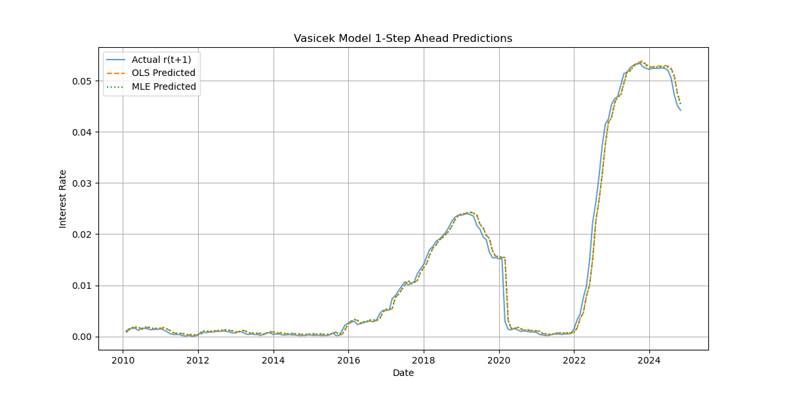

Vasicek Interest rate model is a mathematical method of modelling the movement and evolution of interest rates. It is a single factor model that predicts the evolution of interest rate prices over time. Since it is a single factor model, it takes into account only the market risk.
Apart from Vasicek, there are other single factor models that exists:
	i. *Merton Model -* This is helpful in determining the company's credit risk
	ii. *Cox-Ingersoll-Ross Model -* determines the interest rates in future by incorporating volatility, mean, and spread
	iii. *Hull-White Model -* Used to price interest rate derivatives. Assumes volatility will be low when short-term interest rates are near zero.
$$dr_t = a(b -r_t)dt + \sigma dW_t$$
Where:

- $d_t$ - change in interest rate
- $a$ - $(a > 0)$ speed of mean reversion i.e. how fast the interest rate returns to the mean
- $b$ - long term average rate
- $r_t$ - interest rate at time $t$
- $dt$ - small change in time $\frac{1}{252}$
- $\sigma$ - $\sigma > 0$ volatility of interest rate
- $dW_t$ - Wiener process (Brownian Motion). The randomness or unpredictability fluctuation in interest over time. $dW_t = Z_t  \sqrt{\Delta t}$  where $Z_t$ is a random generated number from a standard normal distribution.
$a(b-r_t)dt$ is the deterministic part (drift) and $\sigma dW_t$ is the stochastic part.

## Model Assumptions
The Vasicek Interest rate model makes the following:
	I. Interest rates follow a mean-reverting stochastic process
	II. Normally distributed interest rates. This occurs as the model is based on Brownian motion accounting for the possibility of negative interest rates which is a limitation.
	III. No arbitrage. Since the model is typically used under the risk-neutral measure, it assumes arbitrage-free markets.
## Model Calibration

For the Vasicek model to be useful, model calibration is necessary. Model calibration refers to the process of fine turning the model so that its output closely reflect the reality. In reference to the Vasicek model, we calibrate $a,b$ and $\sigma$. 

### Step 1: Discretize the Model
Finance data is usually provided in discrete intervals e.g. daily, monthly, or yearly. Since Vasicek Model is a continuous time stochastic differential equation, we will have to make it discrete to use it with our discrete data. Using the Euler-Maruyama discretisation method we have:
$$r_{t+1} = r_t + a(b - r_t)\Delta t + \sigma \sqrt{\Delta t} \epsilon _{t} $$
Where:
- $\Delta t : -$ time increment between observations $\frac{1}{252}$
- $a (b -r_t) \Delta t :-$ deterministic component representing the pull towards the mean
- $\epsilon _t : -$ stochastic component capturing the random stock at time $t$
- $\epsilon _t \sim \mathcal{N}(0,1) :-$ standard normal random variable

The above equation can be rewritten as:
$$r_{t+1} = r_t - ar_t \Delta t + ab \Delta t + \sigma \sqrt{\Delta t} \epsilon_t$$
$$r_{t+1} = (1 - a \Delta t)r_t + ab \Delta t + \sigma \sqrt{\Delta t} \epsilon_t$$
Letting $\alpha = (1-a\Delta t)$, $\beta = ab\Delta t$ and $\xi = \sigma \sqrt{\Delta t} \epsilon_t$ 
$$r_{t+1}  = \alpha r_t + \beta + \xi$$
### Step 2: Use OLS to estimate the parameters $\alpha$ and $\beta$
$$\hat{a} = - \frac{In(\hat{\beta})}{\Delta t}$$
$$\hat{b} = \frac{\hat{\alpha}}{\Delta t(1 - \hat{\beta})}$$
### Step 3: Estimate $\sigma$
From residuals $\epsilon_t = r_{t +1} - \hat{\alpha}- \hat{\beta} r_t$, Compute
$$\hat{\sigma} = \sqrt{\frac{Var(\epsilon_t)}{\Delta t}}$$
### Step 4: Validation
- Check residual for normality and independence
- Compare model with yield curve or bond prices to observed market data


## Alternatively, using MLE
Using the maximum Likelihood Method (MLE) method to calibrate Vasicek model is more efficient compared to the OLS method. 
### Step 1: Get the Transition Distribution
The vasicek model has a closed-form solution for its transition (conditional) distribution:
$$r_{t+1}| r_t \sim \mathcal{N}(\mu_t, \sigma^2 _t) $$
where:
- $\mu_t = b + (r_t -b)e^{-\alpha \Delta t}$
- $\sigma^2_t = \frac{\sigma^2}{2a}(1-e^{-2a\Delta t})$
this gives the probability density of observing $r_{t + \Delta t}$ under parameters $a,b,\sigma$

### Step 2: Write the Log-Likelihood fn
Given a time series of interest rates $r_0, r_1..., r_n$ at interval $\Delta t$, the log-likelihood is:
$$\mathcal{L}(a,b,\sigma) = \sum^n_{i = 1}log f(r_i|r_{i-1}; a,b,\sigma)$$
where each term in the sum is the log of the normal density:
$$log f(r_i|r_i-1) = - \frac{1}{2}log(2\pi \sigma^2_t)- \frac{r_i -\mu_{i-1}^2}{2\sigma^2_t}$$
where:
- $\mu_t = b + (r_t -b)e^{-\alpha \Delta t}$
- $\sigma^2_t = \frac{\sigma^2}{2a}(1-e^{-2a\Delta t})$
### Step 3: Maximize the Log-Likelihood
Now that you have a function L(a,b,σ)L(a,b,σ), use a numerical optimizer to find the parameter values that maximize it.

### Step 4: Evaluate the fit
After finding the optimal a,b,σ:
- Simulate paths or calculate bond prices
- Compare to actual data or yields
- Plot residuals to verify normality and independence

```py
import numpy as np
import pandas as pd
import matplotlib.pyplot as plt
from pandas_datareader import data as pdr
from scipy.optimize import minimize
import statsmodels.api as sm
import datetime

# === STEP 1: Load real market data ===
def load_data():
    start = datetime.datetime(2010, 1, 1)
    end = datetime.datetime(2024, 12, 31)
    df = pdr.DataReader('TB3MS', 'fred', start, end).dropna()
    df = df.rename(columns={'TB3MS': 'rate'})
    df['rate'] = df['rate'] / 100  # Convert to decimal
    df['rate_next'] = df['rate'].shift(-1)
    df.dropna(inplace=True)
    return df

# === STEP 2: Vasicek OLS calibration ===
def vasicek_OLS(rates, delta_t):
    r_t = rates[:-1]
    r_next = rates[1:]

    X = sm.add_constant(r_t)
    model = sm.OLS(r_next, X)
    results = model.fit()
    alpha_hat, beta_hat = results.params

    a = -np.log(beta_hat) / delta_t
    b = alpha_hat / (1 - beta_hat)
    residuals = r_next - (alpha_hat + beta_hat * r_t)
    sigma = np.std(residuals) / np.sqrt(delta_t)

    return {'a': a, 'b': b, 'sigma': sigma, 'predicted': alpha_hat + beta_hat * r_t}

# === STEP 3: Vasicek MLE calibration ===
def vasicek_MLE(rates, delta_t):
    r_t = rates[:-1]
    r_next = rates[1:]

    def neg_log_likelihood(params):
        a, b, sigma = params
        if a <= 0 or sigma <= 0:
            return np.inf
        mu = b + (r_t - b) * np.exp(-a * delta_t)
        var = (sigma ** 2) / (2 * a) * (1 - np.exp(-2 * a * delta_t))
        return 0.5 * np.sum(np.log(2 * np.pi * var) + ((r_next - mu) ** 2) / var)

    initial = [0.1, 0.03, 0.01]
    bounds = [(1e-5, None), (0, 1), (1e-5, None)]
    result = minimize(neg_log_likelihood, initial, method='L-BFGS-B', bounds=bounds)
    a, b, sigma = result.x

    mu = b + (r_t - b) * np.exp(-a * delta_t)
    return {'a': a, 'b': b, 'sigma': sigma, 'predicted': mu}

# === STEP 4: Evaluation ===
def evaluate_model(predicted, actual):
    return np.sqrt(np.mean((predicted - actual) ** 2))

# === RUN EVERYTHING ===
df = load_data()
rates = df['rate'].values
delta_t = 1 / 12  # monthly

ols_result = vasicek_OLS(rates, delta_t)
mle_result = vasicek_MLE(rates, delta_t)

actual = df['rate'].values[1:]

print("\n=== Vasicek OLS Calibration ===")
print(f"a: {ols_result['a']:.4f}, b: {ols_result['b']:.4f}, sigma: {ols_result['sigma']:.4f}")
rmse_ols = evaluate_model(ols_result['predicted'], actual)
print(f"RMSE: {rmse_ols:.6f}")

print("\n=== Vasicek MLE Calibration ===")
print(f"a: {mle_result['a']:.4f}, b: {mle_result['b']:.4f}, sigma: {mle_result['sigma']:.4f}")
rmse_mle = evaluate_model(mle_result['predicted'], actual)
print(f"RMSE: {rmse_mle:.6f}")

# === PLOT COMPARISON ===
plt.figure(figsize=(12, 6))
plt.plot(df.index[1:], actual, label='Actual r(t+1)', alpha=0.7)
plt.plot(df.index[1:], ols_result['predicted'], label='OLS Predicted', linestyle='--')
plt.plot(df.index[1:], mle_result['predicted'], label='MLE Predicted', linestyle=':')
plt.title('Vasicek Model 1-Step Ahead Predictions')
plt.xlabel('Date')
plt.ylabel('Interest Rate')
plt.legend()
plt.grid(True)
plt.show()
```



```bash
=== Vasicek OLS Calibration ===
a: -0.0576, b: -0.0392, sigma: 0.0053
RMSE: 0.001541

=== Vasicek MLE Calibration ===
a: 0.0030, b: 1.0000, sigma: 0.0053
RMSE: 0.001543
```

#### Interpretation
##### Vasicek OLS Model
In the vasicek OLS model calibration we find the values $a = -0.0576, b = -0.0392, \sigma = 0.0053$, and $RMSE = 0.01541$
- Automatically from the value of `a` the model has an error as `a` should be positive as it represents the revert rate speed to the mean. A negative values indicates that the model is divergent hence violating the model assumption.
- The value of `b` is also negative. Although the Vasicek model allows for negative interest rates its economically unrealistic in the long-term. Moreover, we are dealing with the U.S. which has had no history of negative interest rates.

##### Vasicek MLE Model
In the vasicek MLE model calibration we find the values $a = 0.0030, b = 1.000, \sigma = 0.0053$, and $RMSE = 0.001543$. 
- The value of `b` is suspicious. It's unrealistic for `b` to be 100%. This may be an issue of over-fitting or poor local minimum in the optimization. 
# References
https://www.soa.org/48e9a7/globalassets/assets/files/resources/research-report/2023/interest-rate-model-calibration-study.pdf

https://www.thefinanalytics.com/post/calibrating-the-vasicek-model-using-historical-interest-rate-data